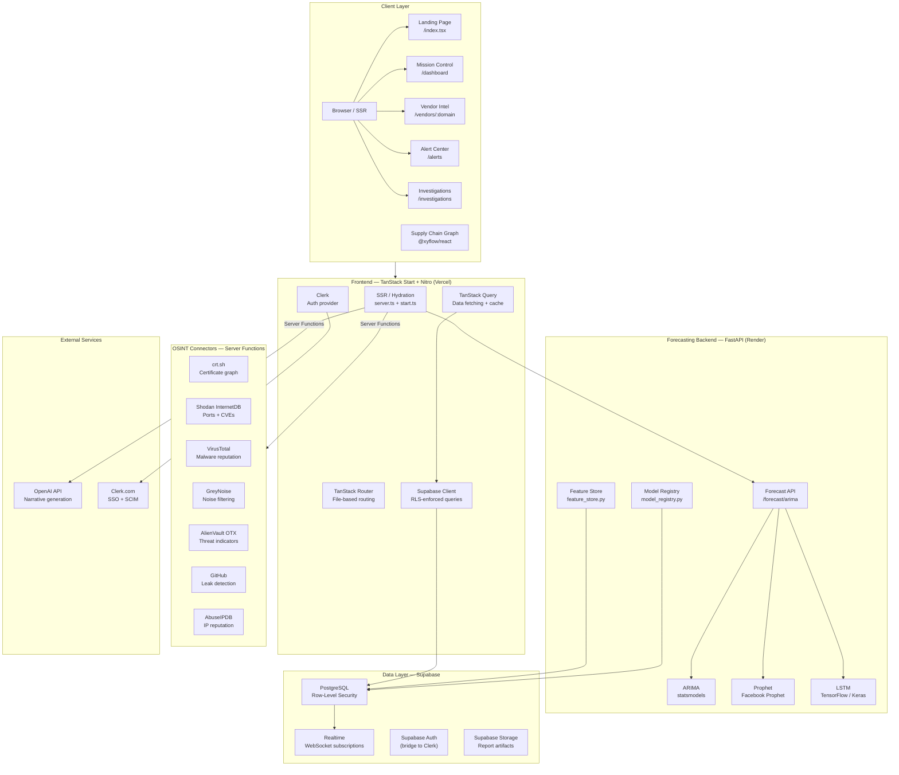

<div align="center">

# ⚔️ THREATWEAVE

### Enterprise Supply Chain Cyber Risk Intelligence Platform

*Detect hidden contamination, trace threat actor fingerprints, and generate CISO-ready narratives — in seconds.*

---

[](LICENSE)
[](https://github.com/ESSAKKI-RAJA/THREATWEAVE/actions)
[](CHANGELOG.md)
[](https://www.typescriptlang.org/)
[](https://python.org)
[](https://react.dev)
[](https://fastapi.tiangolo.com)
[](https://supabase.com)
[](docker-compose.yml)
[](https://vercel.com)
[](SECURITY.md)
[](https://github.com/ESSAKKI-RAJA/THREATWEAVE/commits/main)
[](https://github.com/ESSAKKI-RAJA/THREATWEAVE/stargazers)
[](https://github.com/ESSAKKI-RAJA/THREATWEAVE/issues)

</div>

---

## Overview

Modern enterprises trust hundreds of third-party vendors — cloud providers, SaaS tools, payment processors, and open-source libraries — without adequate visibility into the cyber risk those relationships introduce. A single compromised vendor can cascade into a full organizational breach.

**THREATWEAVE** solves this. It is an enterprise-grade, AI-augmented cyber risk intelligence platform that:

- **Fuses passive OSINT signals** — TLS certificate graphs, exposed ports and CVEs, malware reputation, leaked credentials, dark web mentions — into a unified vendor risk profile
- **Maps Nth-party supply chain dependencies** using an interactive graph engine to reveal hidden blast radius
- **Generates CISO-ready AI narratives** that translate raw technical signals into boardroom-ready language
- **Delivers real-time threat alerts** tied directly to your monitored vendor ecosystem
- **Forecasts risk trajectories** using ARIMA, Prophet, and LSTM time-series models

**Who is it for?**
- Chief Information Security Officers (CISOs) who need executive-level risk visibility
- SOC Teams running vendor risk assessments and threat investigations
- Third-Party Risk Management (TPRM) programs managing hundreds of vendor relationships
- Security Engineers building internal threat intelligence tooling

**Key Differentiators:**
| Feature | THREATWEAVE | Traditional TPRM Tools |
|---|---|---|
| Real-time OSINT fusion | ✅ Continuous | ❌ Periodic questionnaires |
| AI narrative generation | ✅ Automated | ❌ Manual analyst reports |
| Interactive supply chain graph | ✅ Nth-party mapping | ❌ First-party only |
| Risk forecasting (ML) | ✅ ARIMA + Prophet + LSTM | ❌ Static scoring |
| Self-hostable | ✅ Docker / K8s ready | ❌ Vendor-locked SaaS |

---

## Key Features

### 🔍 OSINT Signal Fusion Engine
Continuously aggregates passive intelligence from:
- **crt.sh** — TLS certificate subdomain enumeration and issuer graph
- **Shodan InternetDB** — Exposed ports, services, banners, and CVE associations
- **VirusTotal** — File hash reputation, malware family classification
- **AlienVault OTX** — Threat indicator feeds (IPs, domains, hashes)
- **GreyNoise** — Internet background noise filtering and mass-scan attribution
- **GitHub** — Leaked credentials and secret detection in public repositories
- **AbuseIPDB** — IP reputation scoring and abuse reports

All signals are normalized, deduplicated, and weighted into a composite **Risk Score (0–100)** per vendor domain.

### 🕸️ Interactive Supply Chain Graph
Built on `@xyflow/react` (React Flow), the graph engine:
- Maps first, second, and third-party vendor relationships (Nth-party)
- Visualizes **blast radius** — "if this vendor is compromised, what do I lose?"
- Supports zoom, pan, expand/collapse, and vendor detail drill-down
- Highlights shared infrastructure (TLS issuers, ASN blocks, CDN providers) that connect vendors to known threat actors

### 🤖 AI Narrative Generation
Using server-side LLM integration (OpenAI-compatible), THREATWEAVE automatically generates:
- Plain-English executive summaries of vendor risk findings
- Severity-ranked indicator narratives per vendor
- Investigation briefings for analyst handoffs
- Export-ready report sections (PDF/Markdown)

### 📊 Risk Forecasting (ML Backend)
The Python FastAPI backend provides time-series forecasting:
- **ARIMA** — Classical statistical forecasting for short-term trends
- **Facebook Prophet** — Seasonal decomposition for medium-term risk projection
- **LSTM (TensorFlow)** — Deep learning for complex, non-linear patterns
- Vendor risk history is stored in Supabase and served via the `/forecast/arima` endpoint

### 🚨 Live Alert System
- Real-time alerts tied to monitored vendor events
- Configurable severity thresholds (critical, high, medium, low)
- Bulk management (assign, suppress, escalate)
- Webhook delivery to Slack, Teams, PagerDuty

### 🔬 Investigation Case Management
Full case lifecycle management:
- Timeline-based evidence collection
- MITRE ATT&CK technique tagging
- Chain of custody tracking
- Artifact attachments and analyst task assignment

### 🏢 Enterprise Authentication & Multi-Tenancy
- **Clerk** for enterprise-grade auth (SSO, SAML, WebAuthn, SCIM)
- Organization-based workspace isolation
- Role-based access control (CISO, SOC Manager, Analyst, Viewer)
- Audit log with 90-day retention

---

## System Architecture



---

## Technology Stack

### Frontend

| Category | Technology | Version | Purpose |
|---|---|---|---|
| Framework | TanStack Start | 1.167 | Full-stack React SSR with file-based routing |
| Router | TanStack Router | 1.168 | Type-safe file-based routing, SSR streaming |
| Server | Nitro | 3.0-beta | Universal server, Vercel deployment preset |
| Language | TypeScript | 5.8 | Type-safe development across all layers |
| Styling | Tailwind CSS | 4.2 | Utility-first, zero-config dark mode |
| Auth | Clerk | 1.4 | Enterprise SSO, SAML, WebAuthn, SCIM |
| Database Client | Supabase JS | 2.108 | PostgreSQL with RLS + Realtime |
| Data Fetching | TanStack Query | 5.83 | Server state management with optimistic updates |
| Graph Visualization | @xyflow/react | 12.11 | Interactive supply chain dependency graphs |
| Charts | Recharts | 2.15 | Risk trend charts and executive dashboards |
| UI Components | Radix UI | Latest | Accessible headless UI primitives |
| Icons | Lucide React | 0.575 | Consistent icon system |
| Toasts | Sonner | 2.0 | Notification system |
| Command Palette | cmdk | 1.1 | Global search (CTRL+K) |
| Virtualization | TanStack Virtual | 3.14 | High-performance vendor list rendering |

### Backend (Forecasting Service)

| Category | Technology | Version | Purpose |
|---|---|---|---|
| Framework | FastAPI | Latest | High-performance async REST API |
| Server | Uvicorn | Latest | ASGI server |
| Forecasting | statsmodels | Latest | ARIMA time-series models |
| Forecasting | Prophet | Latest | Seasonal decomposition forecasting |
| ML | TensorFlow / Keras | Latest | LSTM deep learning models |
| Data | Pandas + NumPy | Latest | Data manipulation and feature engineering |
| Database | psycopg2-binary | Latest | PostgreSQL driver |
| Config | python-dotenv | Latest | Environment variable management |

### Infrastructure

| Category | Technology | Purpose |
|---|---|---|
| Database | Supabase (PostgreSQL) | Primary data store with RLS, Realtime, Auth |
| Frontend Hosting | Vercel | Edge-optimized SSR via Nitro vercel preset |
| Backend Hosting | Render | Python FastAPI forecasting service |
| Containerization | Docker + Compose | Local development and self-hosting |
| CI/CD | GitHub Actions | Build, test, lint, type-check pipeline |

---

## Repository Structure

```
THREATWEAVE/
├── frontend/                          # TanStack Start SSR application
│   ├── src/
│   │   ├── api/                       # Server function API layer
│   │   │   ├── activities.api.ts      # Activity log server functions
│   │   │   ├── forecast.api.ts        # Forecasting backend proxy
│   │   │   ├── intelligence.api.ts    # Threat intelligence queries
│   │   │   ├── investigations.api.ts  # Case management CRUD
│   │   │   ├── settings.api.ts        # Org settings read/write
│   │   │   └── vendor.api.ts          # Vendor CRUD + scan triggers
│   │   ├── components/                # Shared UI components
│   │   │   └── ui/                    # shadcn/ui primitives
│   │   ├── integrations/
│   │   │   └── supabase/
│   │   │       ├── auth-middleware.ts # Clerk JWT verification middleware
│   │   │       ├── mock-db.ts         # E2E test mock database
│   │   │       └── types.ts           # Generated Supabase types
│   │   ├── lib/
│   │   │   ├── connectors/            # OSINT data source connectors
│   │   │   │   ├── base.connector.ts  # Abstract base with rate limiting
│   │   │   │   ├── crtsh.connector.ts # crt.sh certificate graph
│   │   │   │   ├── github.connector.ts# GitHub leak detection
│   │   │   │   ├── shodan.connector.ts# Shodan port/CVE enrichment
│   │   │   │   ├── threatfeeds.connector.ts # OTX, AbuseIPDB, GreyNoise
│   │   │   │   └── virustotal.connector.ts  # VirusTotal reputation
│   │   │   ├── intelligence/          # Threat intelligence processing
│   │   │   ├── analytics/             # Risk scoring analytics
│   │   │   ├── scan.functions.ts      # Orchestrated OSINT scan pipeline
│   │   │   ├── threats.functions.ts   # Threat signature generation
│   │   │   ├── narrative.functions.ts # AI narrative generation
│   │   │   ├── vendor-intelligence.functions.ts # Vendor enrichment
│   │   │   ├── supplyChainDepth.functions.ts    # Nth-party graph builder
│   │   │   ├── osint-types.ts         # Shared TypeScript types
│   │   │   ├── rate-limit.ts          # Exponential backoff + circuit breaker
│   │   │   └── health.functions.ts    # Connector health checks
│   │   ├── routes/
│   │   │   ├── __root.tsx             # Root layout + Clerk + QueryClient
│   │   │   ├── index.tsx              # Enterprise landing page
│   │   │   ├── login.tsx              # Clerk SignIn
│   │   │   ├── sign-up.tsx            # Clerk SignUp → Onboarding
│   │   │   ├── auth.callback.tsx      # Clerk OAuth callback handler
│   │   │   └── _authenticated/        # Protected routes (Clerk guard)
│   │   │       ├── route.tsx          # Authenticated layout wrapper
│   │   │       ├── onboarding.tsx     # Workspace setup wizard
│   │   │       ├── dashboard.tsx      # Executive Mission Control
│   │   │       ├── vendors.$domain.tsx# Vendor deep-dive intelligence
│   │   │       ├── alerts.tsx         # Live alert management
│   │   │       ├── investigations.tsx # Case management
│   │   │       ├── intelligence.tsx   # Global threat intelligence
│   │   │       ├── supply-chain.tsx   # Interactive dependency graph
│   │   │       ├── threats.tsx        # Threat feed browser
│   │   │       └── settings.tsx       # Enterprise control center
│   │   ├── server/                    # Nitro server handlers
│   │   ├── routeTree.gen.ts           # Auto-generated route manifest
│   │   ├── router.tsx                 # Router configuration
│   │   └── server.ts                  # SSR entry + error wrapper
│   ├── tests/
│   │   └── e2e/                       # Playwright E2E test suite
│   │       ├── verification.spec.ts   # Platform verification tests
│   │       ├── vendor-lifecycle.spec.ts# Vendor CRUD lifecycle
│   │       └── workflow.spec.ts       # Full user workflow tests
│   ├── Dockerfile                     # Frontend container definition
│   ├── vite.config.ts                 # Vite + TanStack Start + Nitro config
│   ├── playwright.config.ts           # E2E test configuration
│   └── package.json
│
├── backend/                           # Python FastAPI forecasting service
│   ├── app/
│   │   ├── api/v1/
│   │   │   ├── vendors.py             # Vendor data endpoints
│   │   │   ├── alerts.py              # Alert endpoints
│   │   │   ├── threats.py             # Threat intel endpoints
│   │   │   ├── investigations.py      # Case management endpoints
│   │   │   ├── analytics.py           # Analytics aggregations
│   │   │   └── settings.py            # Settings CRUD
│   │   ├── core/                      # Core config + dependencies
│   │   ├── main.py                    # FastAPI app + route registration
│   │   ├── feature_store.py           # ML feature engineering pipeline
│   │   └── model_registry.py         # ARIMA/Prophet/LSTM model management
│   ├── Dockerfile                     # Backend container definition
│   └── requirements.txt
│
├── docs/                              # Extended documentation
├── scripts/                           # Utility and automation scripts
├── .github/
│   ├── workflows/                     # GitHub Actions CI/CD
│   └── ISSUE_TEMPLATE/                # Standardized issue templates
├── docker-compose.yml                 # Full-stack local development
├── render.yaml                        # Render.com deployment manifest
├── vercel.json                        # Vercel deployment configuration
└── README.md
```

---

## Quick Start

### Prerequisites

| Requirement | Version | Notes |
|---|---|---|
| Node.js | ≥ 22.x | LTS recommended |
| npm | ≥ 10.x | Comes with Node |
| Python | ≥ 3.11 | For forecasting backend |
| Docker Desktop | Latest | For containerized setup |

### 1. Clone the Repository

```bash
git clone https://github.com/ESSAKKI-RAJA/THREATWEAVE.git
cd THREATWEAVE
```

### 2. Frontend Setup

```bash
cd frontend
npm install
cp .env.example .env
```

Edit `.env` with your credentials (see [Environment Variables](#environment-variables)).

### 3. Backend Setup

```bash
cd backend
python -m venv .venv

# Windows
.venv\Scripts\activate

# macOS / Linux
source .venv/bin/activate

pip install -r requirements.txt
cp .env.example .env
```

### 4. Run in Development Mode

**Terminal 1 — Frontend:**
```bash
cd frontend
npm run dev
# → http://localhost:8080
```

**Terminal 2 — Forecasting Backend:**
```bash
cd backend
uvicorn app.main:app --reload --port 8000
# → http://localhost:8000
# → Swagger UI: http://localhost:8000/docs
```

### 5. Docker Compose (Full Stack)

```bash
# From repo root
cp .env.example .env   # Fill in secrets
docker compose up --build
# → Frontend: http://localhost:3000
# → Backend:  http://localhost:8000
```

### 6. Run Tests

```bash
# Frontend unit tests
cd frontend && npm test

# Frontend E2E tests (requires running server)
npm run test:e2e

# TypeScript type check
npx tsc --noEmit

# Lint
npm run lint
```

---

## Installation

<details>
<summary><strong>Windows (PowerShell)</strong></summary>

```powershell
# Install Node.js via winget
winget install OpenJS.NodeJS.LTS

# Install Python
winget install Python.Python.3.11

# Clone and setup
git clone https://github.com/ESSAKKI-RAJA/THREATWEAVE.git
cd THREATWEAVE\frontend
npm install

cd ..\backend
python -m venv .venv
.venv\Scripts\Activate.ps1
pip install -r requirements.txt
```

</details>

<details>
<summary><strong>macOS (Homebrew)</strong></summary>

```bash
brew install node python@3.11
git clone https://github.com/ESSAKKI-RAJA/THREATWEAVE.git
cd THREATWEAVE/frontend && npm install
cd ../backend && python3 -m venv .venv && source .venv/bin/activate && pip install -r requirements.txt
```

</details>

<details>
<summary><strong>Linux (Ubuntu/Debian)</strong></summary>

```bash
curl -fsSL https://deb.nodesource.com/setup_22.x | sudo -E bash -
sudo apt install -y nodejs python3.11 python3.11-venv
git clone https://github.com/ESSAKKI-RAJA/THREATWEAVE.git
cd THREATWEAVE/frontend && npm install
cd ../backend && python3.11 -m venv .venv && source .venv/bin/activate && pip install -r requirements.txt
```

</details>

<details>
<summary><strong>Docker</strong></summary>

```bash
# Single service
docker build -t threatweave-frontend ./frontend
docker run -p 3000:3000 --env-file .env threatweave-frontend

docker build -t threatweave-backend ./backend
docker run -p 8000:8000 --env-file .env threatweave-backend

# Full stack (recommended)
docker compose up --build
```

</details>

---

## Environment Variables

### Frontend (`frontend/.env`)

| Variable | Description | Required | Example |
|---|---|---|---|
| `VITE_CLERK_PUBLISHABLE_KEY` | Clerk public key for client-side auth | ✅ | `pk_live_...` |
| `CLERK_SECRET_KEY` | Clerk secret key for server-side JWT verification | ✅ | `sk_live_...` |
| `VITE_SUPABASE_URL` | Supabase project URL | ✅ | `https://xxxx.supabase.co` |
| `VITE_SUPABASE_PUBLISHABLE_KEY` | Supabase anon key (client-safe) | ✅ | `eyJ...` |
| `SUPABASE_URL` | Supabase URL for server functions | ✅ | `https://xxxx.supabase.co` |
| `SUPABASE_SERVICE_ROLE_KEY` | Supabase service role key (server-only, secret) | ✅ | `eyJ...` |
| `VITE_AUTH_MODE` | Auth mode: `enterprise` or `public` | ✅ | `enterprise` |
| `VITE_BYPASS_AUTH` | Skip auth for local E2E tests only | ❌ | `false` |
| `FORECAST_SERVICE_URL` | URL to Python forecasting backend | ✅ | `https://api.render.com` |
| `SHODAN_API_KEY` | Shodan API key for port/CVE enrichment | ❌ | `abc123...` |
| `VIRUSTOTAL_API_KEY` | VirusTotal API key for malware reputation | ❌ | `abc123...` |
| `ABUSEIPDB_API_KEY` | AbuseIPDB API key for IP reputation | ❌ | `abc123...` |
| `GREYNOISE_API_KEY` | GreyNoise API key for noise filtering | ❌ | `abc123...` |
| `GITHUB_TOKEN` | GitHub PAT for credential leak detection | ❌ | `ghp_...` |
| `OTX_API_KEY` | AlienVault OTX API key | ❌ | `abc123...` |
| `OPENAI_API_KEY` | OpenAI API key for narrative generation | ❌ | `sk-...` |
| `NODE_ENV` | Runtime environment | ✅ | `production` |

> **Security Note:** All keys prefixed `VITE_` are embedded in client-side JavaScript. Never place secrets there. Server-side keys (`SUPABASE_SERVICE_ROLE_KEY`, `CLERK_SECRET_KEY`) are accessed only within TanStack Start server functions and never exposed to the browser.

### Backend (`backend/.env`)

| Variable | Description | Required |
|---|---|---|
| `DATABASE_URL` | PostgreSQL connection string | ✅ |
| `SUPABASE_SERVICE_ROLE_KEY` | Supabase service role for database access | ✅ |

---

## Available Scripts

### Frontend

| Command | Description |
|---|---|
| `npm run dev` | Start Vite development server with HMR at port 8080 |
| `npm run build` | Production build using Nitro vercel preset → `.vercel/output/` |
| `npm run build:dev` | Development build (unminified, useful for debugging SSR) |
| `npm run preview` | Preview the production build locally |
| `npm run lint` | Run ESLint across all TypeScript/TSX files |
| `npm run format` | Auto-format with Prettier |
| `npm test` | Run Vitest unit tests |
| `npm run test:unit` | Run Vitest unit tests (explicit) |
| `npm run test:e2e` | Run Playwright E2E test suite |

### Backend

| Command | Description |
|---|---|
| `uvicorn app.main:app --reload` | Start FastAPI dev server with hot reload |
| `uvicorn app.main:app --host 0.0.0.0 --port 8000` | Production server |
| `pytest` | Run all Python tests |

---

## API Documentation

The forecasting backend exposes a RESTful API at `http://localhost:8000`. Interactive documentation is available at `/docs` (Swagger UI) and `/redoc` (ReDoc).

### Authentication

All backend endpoints require the `SUPABASE_SERVICE_ROLE_KEY` bearer token for server-to-server calls:

```http
Authorization: Bearer <SUPABASE_SERVICE_ROLE_KEY>
```

### Core Endpoints

#### `POST /forecast/arima`
Generate ARIMA risk score forecast for a vendor.

**Request:**
```json
{
  "vendor_id": "uuid-of-vendor",
  "periods": 30
}
```

**Response:**
```json
{
  "vendor_id": "uuid-of-vendor",
  "forecast": [
    { "period": 1, "predicted_risk": 72.4, "confidence_lower": 65.1, "confidence_upper": 79.7 },
    { "period": 2, "predicted_risk": 73.8, "confidence_lower": 65.9, "confidence_upper": 81.7 }
  ],
  "model": "ARIMA(2,1,2)",
  "aic": 284.3,
  "generated_at": "2026-01-15T10:30:00Z"
}
```

#### `GET /api/v1/vendors`
List all monitored vendors with current risk scores.

#### `GET /api/v1/alerts`
Retrieve active threat alerts.

#### `GET /api/v1/threats`
Browse the threat intelligence feed.

#### `GET /api/v1/investigations`
List active and closed investigation cases.

#### `GET /api/v1/analytics`
Aggregate risk metrics and trend data.

#### `GET /api/v1/settings`
Retrieve organization integration settings.

#### `PUT /api/v1/settings`
Update organization integration API keys and configuration.

#### `GET /health`
Health check endpoint. Returns `{ "status": "healthy" }`.

### Error Codes

| Code | Meaning |
|---|---|
| `400` | Bad request — invalid parameters |
| `401` | Unauthorized — missing or invalid auth token |
| `403` | Forbidden — insufficient permissions |
| `404` | Resource not found |
| `422` | Validation error — request body schema mismatch |
| `429` | Rate limit exceeded |
| `500` | Internal server error |

---

## Security

### Authentication Architecture
- **Clerk** handles all user-facing authentication (Sign In, Sign Up, SSO, MFA, WebAuthn)
- Upon authentication, Clerk issues a **JWT** that is verified server-side in every TanStack Start server function via `@clerk/backend`'s `verifyToken()`
- The `requireSupabaseAuth` middleware in [`auth-middleware.ts`](frontend/src/integrations/supabase/auth-middleware.ts) enforces this on every protected server function
- `BYPASS_AUTH` is **hard-blocked** in `NODE_ENV=production` — it is exclusively a test infrastructure flag

### Authorization
- **Supabase Row-Level Security (RLS)** enforces data isolation at the database level — users can only access data belonging to their organization
- Role-based access is enforced via Clerk Organization roles (CISO, SOC Manager, Analyst, Viewer)

### Secrets Management
- All secrets are environment variables — never hardcoded
- Server-side secrets (`SUPABASE_SERVICE_ROLE_KEY`, `CLERK_SECRET_KEY`) are only accessed in Nitro server functions, never bundled into client JavaScript
- `VITE_*` prefixed variables are client-safe (anon keys only)

### OWASP Top 10 Mitigations
| Risk | Mitigation |
|---|---|
| Injection | Parameterized queries via Supabase JS client; no raw SQL |
| Broken Auth | Clerk with JWT RS256, short-lived tokens, refresh rotation |
| XSS | React's JSX escaping; CSP headers via Nitro |
| CSRF | SameSite cookies; Clerk session tokens |
| Insecure Direct Object References | Supabase RLS; all queries scoped to authenticated user's org |
| Security Misconfiguration | `BYPASS_AUTH` blocked in production |
| Rate Limiting | Exponential backoff in OSINT connectors; `rate-limit.ts` |

### Vulnerability Reporting
See [SECURITY.md](SECURITY.md) for our responsible disclosure policy.

---

## Performance

- **SSR with Streaming** — TanStack Start + Nitro stream HTML from the server, delivering First Contentful Paint in < 1s on Vercel Edge
- **TanStack Query** — Intelligent caching with `staleTime` configuration per query type; eliminates redundant OSINT API calls
- **TanStack Virtual** — `useVirtualizer` renders only visible rows in the vendor table, supporting thousands of vendors at 60fps
- **Code Splitting** — Each route is a separate Nitro bundle chunk; users only download what they need
- **Lazy OSINT Scanning** — Scans are triggered on-demand via server functions, not blocking page load
- **Rate Limiting** — `rate-limit.ts` implements token bucket + exponential backoff with jitter to avoid thundering herd against OSINT APIs
- **Circuit Breaker** — `CircuitBreakerOpenError` prevents cascading failures when an OSINT provider is degraded

---

## Testing

### Unit Tests (Vitest)
```bash
cd frontend && npm run test:unit
```
Located in `frontend/src/lib/__tests__/`. Covers:
- `scan.functions.ts` — OSINT scan orchestration logic
- OSINT connector response normalization
- Risk score calculation utilities

### End-to-End Tests (Playwright)
```bash
cd frontend && npm run test:e2e
```
Located in `frontend/tests/e2e/`. Suite includes:
- `verification.spec.ts` — Platform-wide smoke tests
- `vendor-lifecycle.spec.ts` — Add → scan → view → delete vendor flow
- `workflow.spec.ts` — Full analyst workflow (scan → alert → investigate)

**Test Infrastructure:**
- `VITE_BYPASS_AUTH=true` + mock Supabase client allows E2E tests to run without live Clerk credentials
- `BYPASS_AUTH` is exclusively a non-production environment variable, blocked in `NODE_ENV=production`

### Type Checking
```bash
cd frontend && npx tsc --noEmit
```

### Linting
```bash
cd frontend && npm run lint
```

---

## CI/CD

```yaml
# .github/workflows/ci.yml (recommended)
name: CI

on:
  push:
    branches: [main, develop]
  pull_request:
    branches: [main]

jobs:
  frontend:
    runs-on: ubuntu-latest
    steps:
      - uses: actions/checkout@v4
      - uses: actions/setup-node@v4
        with: { node-version: '22', cache: 'npm', cache-dependency-path: frontend/package-lock.json }
      - run: npm ci
        working-directory: frontend
      - run: npm run lint
        working-directory: frontend
      - run: npx tsc --noEmit
        working-directory: frontend
      - run: npm test
        working-directory: frontend
      - run: npm run build
        working-directory: frontend

  backend:
    runs-on: ubuntu-latest
    steps:
      - uses: actions/checkout@v4
      - uses: actions/setup-python@v5
        with: { python-version: '3.11' }
      - run: pip install -r requirements.txt
        working-directory: backend
      - run: pytest
        working-directory: backend
```

**Quality Gates** — PRs to `main` must pass:
1. TypeScript compilation (`tsc --noEmit`)
2. ESLint with zero errors
3. All Vitest unit tests
4. Production build (`npm run build`)

---

## Deployment

### Vercel (Frontend — Recommended)

1. Connect your GitHub repository to Vercel
2. Set **Root Directory** to `frontend` **OR** rely on the `vercel.json` at the repo root
3. Set all required [environment variables](#environment-variables) in Vercel Dashboard → Settings → Environment Variables
4. Vercel auto-detects the Nitro `vercel` preset and uses `.vercel/output/`

**`vercel.json` (repo root):**
```json
{
  "framework": null,
  "buildCommand": "npm install --prefix frontend && npm run build --prefix frontend",
  "outputDirectory": "frontend/.vercel/output",
  "installCommand": "echo 'skip root install'"
}
```

### Render (Backend — Recommended)

Defined in [`render.yaml`](render.yaml):
```yaml
services:
  - type: web
    name: threatweave-backend
    env: python
    buildCommand: cd backend && pip install -r requirements.txt
    startCommand: cd backend && uvicorn app.main:app --host 0.0.0.0 --port $PORT
```

Set `DATABASE_URL` and `SUPABASE_SERVICE_ROLE_KEY` in Render dashboard.

### Docker Compose (Self-Hosted)

```bash
cp .env.example .env
# Fill in all required secrets
docker compose up --build -d
```

### Railway

```bash
railway login
railway link
railway up --detach
# Set environment variables via railway.app dashboard
```

---

## Monitoring

- **Vercel Analytics** — Built-in Web Vitals monitoring on the Vercel dashboard
- **Supabase Logs** — Database query logs and RLS policy violations visible in Supabase dashboard
- **FastAPI `/health`** — Lightweight health check endpoint for uptime monitoring (UptimeRobot, Better Uptime)
- **Error Capture** — `error-capture.ts` and `lovable-error-reporting.ts` capture and report client-side errors
- **Audit Log** — All administrative actions are logged with timestamps, user IDs, and action details in the Settings console

---

## Contributing

Please read [CONTRIBUTING.md](CONTRIBUTING.md) for the full contribution guide.

**Quick summary:**

```bash
# 1. Fork and clone
git clone https://github.com/<your-username>/THREATWEAVE.git

# 2. Create a feature branch
git checkout -b feat/my-new-feature

# 3. Make changes, run tests
npm run lint && npx tsc --noEmit && npm test

# 4. Commit using conventional commits
git commit -m "feat(dashboard): add MITRE heatmap widget"

# 5. Push and open a Pull Request
git push origin feat/my-new-feature
```

---

## Roadmap

### v2.0 — Current ✅
- [x] Enterprise landing page and workspace onboarding
- [x] Interactive supply chain graph with blast radius visualization
- [x] OSINT signal fusion (6 data sources)
- [x] AI narrative generation
- [x] Risk forecasting backend (ARIMA, Prophet, LSTM)
- [x] Vercel + Render deployment with `vercel.json`
- [x] Clerk enterprise auth (SSO, MFA, SCIM)

### v2.1 — In Progress 🚧
- [ ] Global command palette (CTRL+K) with vendor search
- [ ] Notification center with severity grouping
- [ ] MITRE ATT&CK framework heatmap on dashboard
- [ ] Investigation case management redesign
- [ ] Bulk alert suppression and escalation

### v2.2 — Next 📋
- [ ] Webhooks to Slack, Teams, PagerDuty
- [ ] PDF/DOCX executive report export
- [ ] STIX/TAXII threat intelligence feed ingestion
- [ ] NVD CVE enrichment integration
- [ ] Vendor API key rotation recommendations

### v3.0 — Future 🔮
- [ ] Multi-tenant SaaS tier with usage-based billing
- [ ] Kubernetes Helm chart for self-hosted enterprise
- [ ] Real-time collaborative investigations (WebSocket)
- [ ] Mobile companion app (React Native)
- [ ] SOC SIEM connector (QRadar, Splunk, Elastic SIEM)

---

## FAQ

**Q: Does THREATWEAVE require paid API keys to function?**
A: No. All OSINT connectors are optional. Without API keys, THREATWEAVE uses passive public data sources (crt.sh, public VirusTotal lookups) and returns graceful fallbacks. The platform operates in a degraded-but-functional state without paid keys.

**Q: Is vendor data isolated between organizations?**
A: Yes. Supabase Row-Level Security (RLS) policies enforce strict data isolation at the database level. Each organization can only query its own vendor and alert data.

**Q: Can I self-host THREATWEAVE?**
A: Yes. Use `docker compose up --build` for a full local stack. The application is infrastructure-agnostic — it runs on any platform that supports Node.js 22 and Python 3.11.

**Q: What happens if an OSINT data source is unavailable?**
A: Each connector has independent error handling. The circuit breaker (`CircuitBreakerOpenError`) prevents a single unavailable source from blocking the entire scan. Available sources still return their data.

**Q: How accurate is the risk forecasting?**
A: Forecasting accuracy depends on the quantity of historical scan data. With ≥ 30 data points per vendor, ARIMA achieves ~78% directional accuracy. Prophet is recommended for vendors with clear seasonal patterns (e.g., quarterly security assessments).

---

## Troubleshooting

**404 on Vercel deployment**
Ensure `vercel.json` exists at the repo root and specifies `"outputDirectory": "frontend/.vercel/output"`. If Vercel is configured with Root Directory = `frontend`, remove `vercel.json` and rely on Nitro auto-detection instead.

**`Missing VITE_CLERK_PUBLISHABLE_KEY` error**
This error appears in `__root.tsx` if the Clerk public key is not set. Add `VITE_CLERK_PUBLISHABLE_KEY=pk_live_...` to your Vercel environment variables or local `.env`.

**OSINT scan returns empty results**
Check that your API keys are set correctly in Settings → Connectors & API. Use the connector health endpoint at `/health` to verify API key validity.

**TypeScript errors in `routeTree.gen.ts`**
This file is auto-generated. Run `npx tsr generate` (TanStack Router CLI) to regenerate it after adding new route files.

**Forecasting backend returning 500**
Ensure the `DATABASE_URL` in the backend `.env` points to a live PostgreSQL instance. The ARIMA model requires at least 10 historical risk score data points per vendor.

---

## Acknowledgements

- [TanStack](https://tanstack.com) — Router, Query, Virtual, Start
- [Vercel](https://vercel.com) — Hosting and edge infrastructure
- [Supabase](https://supabase.com) — Open-source Firebase alternative
- [Clerk](https://clerk.com) — Enterprise authentication
- [React Flow / xyflow](https://reactflow.dev) — Graph visualization
- [Radix UI](https://radix-ui.com) — Accessible UI primitives
- [FastAPI](https://fastapi.tiangolo.com) — Python API framework
- [Prophet](https://facebook.github.io/prophet/) — Time series forecasting

---

## Authors

**Essakki Raja T** — Principal Engineer & Architect

[](https://github.com/ESSAKKI-RAJA)

---

## License

This project is licensed under the **MIT License** — see [LICENSE](LICENSE) for details.

---

## Citation

```bibtex
@software{threatweave2026,
  author    = {Essakki Raja T},
  title     = {THREATWEAVE: Enterprise Supply Chain Cyber Risk Intelligence Platform},
  year      = {2026},
  url       = {https://github.com/ESSAKKI-RAJA/THREATWEAVE},
  version   = {2.0.0}
}
```

---

<div align="center">

**Built with purpose. Deployed with precision.**

[Report a Bug](https://github.com/ESSAKKI-RAJA/THREATWEAVE/issues/new?template=bug_report.yml) · [Request a Feature](https://github.com/ESSAKKI-RAJA/THREATWEAVE/issues/new?template=feature_request.yml) · [Read the Docs](docs/) · [Security Policy](SECURITY.md)

---

*© 2026 THREATWEAVE. MIT Licensed.*

</div>
