# THREATWEAVE — Post-Refactor Enterprise Architecture Audit

This audit evaluates the refactored THREATWEAVE codebase against the production-grade, enterprise-ready cybersecurity intelligence platform blueprint.

---

## 1. SUBSYSTEM AUDITS

### A. Risk Scoring Engine (`scan.functions.ts`)

- **Architecture Score:** 8.5/10
- **Production Readiness:** Beta (Heuristic-Ready)
- **Strengths:**
  - Linear weighted composition matches the approved blueprint exactly ($25\%$ Exposure, $30\%$ Vulnerability, $15\%$ Reputation, $20\%$ Credential Exposure, $10\%$ Confidence).
  - Vulnerability risk amplification implements compound compounding multipliers for active CISA KEV (x1.5) and high EPSS > 0.7 (x1.3) records.
  - Exposed database, administrative, and unencrypted ports are correctly categorized with varying weights.
- **Weaknesses:**
  - CVE details (CVSS, EPSS, KEV status) are deterministically simulated using a string hashing algorithm rather than querying live feeds (NVD, CISA KEV API, FIRST EPSS API).
  - Exposed certificate parsing evaluates expiration on the first 10 certs instead of parsing the entire chain for certificate chain validity.
- **Technical Debt:**
  - Simulated hash codes inside `computeDetailedRiskScore` must be swapped with live threat intelligence cache lookups.
- **Missing Enterprise Features:**
  - Real-time integration with CVE catalogs and active EPSS daily feeds.
- **Scalability Concerns:**
  - Vulnerability calculations loop through all open CVEs sequentially. Large systems with thousands of open ports and CVEs could block node event loops.
- **Security Concerns:**
  - Relies on public OSINT APIs without sanitizing downstream payloads for injection.
- **Refactoring Recommendations:**
  - Introduce a background job to sync the local vulnerabilities metadata table from NVD daily, mapping CVE IDs directly via database joins rather than computing them in memory during scan cycles.

---

### B. Threat Similarity Engine (`threats.functions.ts`)

- **Architecture Score:** 8.0/10
- **Production Readiness:** Beta (Vector-Attributed)
- **Strengths:**
  - Constructs a highly structured text fingerprint encapsulating ports, CPEs, CAs, and CVE metrics.
  - Leverages `pgvector`'s cosine distance operator (`<=>`) for nearest-neighbor lookups.
  - Implements realistic threat attribution categories (High, Moderate, Limited, Low) with analyst-readable descriptions.
- **Weaknesses:**
  - If `VITE_BYPASS_AUTH = true` and the `LOVABLE_API_KEY` is missing, the system skips embedding calculations, leaving the search vector empty.
- **Technical Debt:**
  - Text-fingerprint serialization format is coupled with OpenAI's `text-embedding-3-small` representation.
- **Missing Enterprise Features:**
  - Attribution confidence levels are calculated strictly via cosine distances without confirming tactical overlapping indicators.
- **Scalability Concerns:**
  - Calculating and inserting multiple threat match logs during scans increases transactional write latency.
- **Security Concerns:**
  - Standard `match_threat_signatures` RPC uses `SECURITY INVOKER`, which may expose other organization signatures if not restricted by RLS on `threat_signatures`.
- **Refactoring Recommendations:**
  - Wrap embedding calls inside an asynchronous background queue, allowing scan completion to return quickly while attribution matches compile offline.

---

### C. Narrative Briefing Generator (`narrative.functions.ts`)

- **Architecture Score:** 7.5/10
- **Production Readiness:** Beta (AI-Powered / Heuristic Fallback)
- **Strengths:**
  - Unified prompting structure maps all enterprise summaries (Executive, Analyst, Compliance, Benchmark, History, Threat, Forecast) into a single JSON schema.
  - Robust regex parsing cleans code fences (` ```json `) returned by standard LLM API models.
- **Weaknesses:**
  - The mock briefing fallback is static and heuristic-based, returning pre-baked statements for development environments.
- **Technical Debt:**
  - Direct fetch calls to `api.anthropic.com` and `Lovable AI Gateway` bypass specialized LLM clients.
- **Missing Enterprise Features:**
  - No verification layer to guarantee the LLM does not hallucinate indicator data.
- **Scalability Concerns:**
  - Large payloads (up to 30,000 characters) are passed directly to LLM contexts, increasing API costs and latency.
- **Security Concerns:**
  - Raw OSINT payloads are injected into prompts without character stripping.
- **Refactoring Recommendations:**
  - Extract prompt builders and LLM connectors into a dedicated `LLMService` wrapper, supporting model rotation and retry strategies.

---

### D. Database Schema & Multi-Tenancy (Migrations)

- **Architecture Score:** 9.5/10
- **Production Readiness:** Enterprise
- **Strengths:**
  - Multi-tenant organization isolation is enforced via Supabase profiles and PostgreSQL RLS.
  - HNSW vector index optimization is applied to `threat_signatures`'s embedding column.
  - Missing relational linkages (assets, exposures, vulnerabilities, benchmarks, predictions) are modeled.
- **Weaknesses:**
  - Dynamic scans table partitioning by date range requires manual schema management.
- **Technical Debt:**
  - RLS helper functions use stable queries, which may introduce minor lookup overhead.
- **Missing Enterprise Features:**
  - Automatic index maintenance routines for HNSW vectors.
- **Scalability Concerns:**
  - As historical data scales, index lookup speeds on partitioned scans might degrade if global indexes are not partitioned.
- **Security Concerns:**
  - Trigger-based user profile creation has broad security permissions (`SECURITY DEFINER`).
- **Refactoring Recommendations:**
  - Set up a PgCron task to automatically manage scans table partition creation.

---

### E. Frontend UI (`vendors.$domain.tsx`)

- **Architecture Score:** 9.0/10
- **Production Readiness:** Production
- **Strengths:**
  - Clean layout cards present multi-perspective summaries (threat analysis, compliance, benchmarks, and projections).
  - Interactive mindmap topology displays target endpoints, resolved ports, and public exposures.
  - Supports delta comparisons, custom print views, and CSV/JSON exports.
- **Weaknesses:**
  - Does not paginate history lists, which could cause sluggish scrolling as scans accumulate.
- **Technical Debt:**
  - Includes inline components and styles, leading to a long file (1039 lines).
- **Missing Enterprise Features:**
  - Custom risk weighting configurations for administrators.
- **Scalability Concerns:**
  - Historical trend line charts attempt to render all raw scan history in a single chart.
- **Security Concerns:**
  - Displays raw repository leak URLs from GitHub without filtering potential malicious redirects.
- **Refactoring Recommendations:**
  - Break the file into smaller, modular components (e.g., `RiskBreakdownCard.tsx`, `HistoryTable.tsx`, `AssetTopologyGraph.tsx`).

---

## 2. EVALUATION OF SPECIFIC CAPABILITIES

| #      | System Capability                  | Implementation Type       | Assessment                                                                                                                                      |
| :----- | :--------------------------------- | :------------------------ | :---------------------------------------------------------------------------------------------------------------------------------------------- |
| **1**  | **Risk Scoring Engine**            | Heuristic Algorithm       | **Excellent framework** matching mathematical weights. However, CVSS/EPSS inputs are simulated via deterministic hashing instead of live feeds. |
| **2**  | **Threat Similarity**              | pgvector + Embeddings     | **Production ready.** Normalizes fingerprints to 1536-dimensional vectors and atribures actors via cosine distance.                             |
| **3**  | **Threat Fingerprint**             | Structured Schema         | **Well designed.** Maps service patterns, open ports, and leak profiles to a strongly-typed, embedding-ready text format.                       |
| **4**  | **Historical Analytics**           | Relational Logs           | **Operational.** Compares current scan against previous records to generate deltas. Needs a rolling 30-day baseline.                            |
| **5**  | **Benchmarking**                   | Simulated Heuristics      | **Placeholder-based.** Percentiles and peer group metrics are calculated using hardcoded constants and relative risk equations.                 |
| **6**  | **Forecasting**                    | Statistical Heuristics    | **Placeholder-based.** Uses simple offsets (+/- constants) to estimate 30/90/180 day outlooks instead of real regression models.                |
| **7**  | **Risk Prediction**                | Probabilistic Interface   | **Placeholder-based.** Returns fixed incident probability metrics to fill dashboard templates.                                                  |
| **8**  | **Attack Surface Drift Detection** | Core State Diff           | **Operational.** Successfully computes new ports, assets, CVEs, and surface growth rates.                                                       |
| **9**  | **AI Reporting**                   | LLM Prompts + Mock        | **Production ready.** Generates comprehensive JSON briefs matching CISO and Compliance targets.                                                 |
| **10** | **Database Architecture**          | Relational + Vector       | **Enterprise grade.** Fully configured RLS policies, HNSW indexing, and multi-tenant schema bounds.                                             |
| **11** | **API Design**                     | TanStack Server Fns       | **Production ready.** Strongly typed schemas, rate-limiting, and auth-checks.                                                                   |
| **12** | **Type Safety**                    | Strict TypeScript         | **Flawless.** Compiles with zero errors across all components.                                                                                  |
| **13** | **Multi-Tenant Readiness**         | DB RLS + Org Profiles     | **Enterprise grade.** Hard boundaries isolate client organizations.                                                                             |
| **14** | **Performance**                    | PgBouncer/Index Optimized | **Production ready.** Employs fast indexing. Loops can be deferred to background workers.                                                       |
| **15** | **Explainability**                 | Detailed Breakdowns       | **Excellent.** Full visibility into scoring weights, KEV/EPSS metrics, and analyst notes.                                                       |

---

## 3. ROADMAP MATURITY

### Overall Product Maturity

**Enterprise MVP**

- The data schemas, multi-tenant isolation, and frontend topology are ready for production.
- However, the benchmarking, forecasting, and prediction engines rely on mock calculations and heuristics to fit the layout.

---

### Estimated Completion %

```mermaid
gantt
    title Roadmap Estimated Completion %
    dateFormat  X
    axisFormat %
    section V1.0 (Core Engine)
    Done :active, v1, 0, 95
    section V2.0 (Attribution/Trend)
    Done :active, v2, 0, 80
    section V3.0 (Supply/ML)
    Done :active, v3, 0, 45
```



- **V1.0 (Core Engine & OSINT Ingestion):** **95%**
  - _Remaining:_ Syncing live CVE/EPSS feeds instead of deterministic hashes.
- **V2.0 (Attribution & Posture Timeline):** **80%**
  - _Remaining:_ Replacing mock benchmarking averages with true aggregated sector queries.
- **V3.0 (Supply Chain & Predictive ML):** **45%**
  - _Remaining:_ Replacing heuristic forecasts with time-series regressions and implementing Graph DB relationship traversals.

---

## 4. TOP 10 HIGHEST PRIORITY GAPS

1.  **Vulnerability Feed Integration:** Implement a daily cron task to fetch active CVSS, EPSS, and CISA KEV datasets from national vulnerability databases instead of using deterministic hashes.
2.  **True Benchmarking Aggregation:** Replace hardcoded industry averages with dynamic SQL aggregates (`AVG()`, `PERCENT_RANK()`) run against all vendors managed within the database.
3.  **Real Forecasting Engine:** Replace constant-offset offsets with a statistical moving average (Holt-Winters) or LSTM regression API.
4.  **Supply Chain Traversals:** Implement Cypher/SQL queries to map vendor-to-vendor relationships, calculating cascading risk propagation across N-tier layers.
5.  **Telemetry Caching:** Integrate Redis cache lookup wrappers around the OSINT connectors to reduce API latency and cost.
6.  **Background Ingestion Worker:** Decouple standard API scans from crawler workers using Kafka/RabbitMQ job queues to avoid gateway timeouts.
7.  **Rolling Baseline Engine:** Shift drift baseline checks from a simple 1-step previous scan comparison to a rolling 30-day average.
8.  **Vulnerability Deduplication:** Add logic to merge overlapping findings from Shodan CPE entries and Censys network banners.
9.  **Audit Logs RLS Enforcement:** Extend audit log policies to allow organization admins to query all logs created by users under their tenant organization.
10. **LLM Error Handling:** Implement fallback models and JSON validators to gracefully handle malformed LLM narrative responses.
