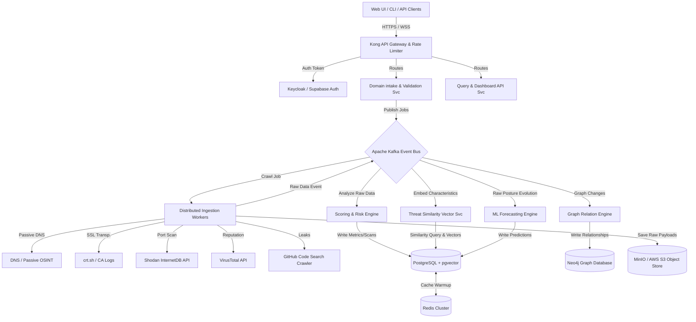
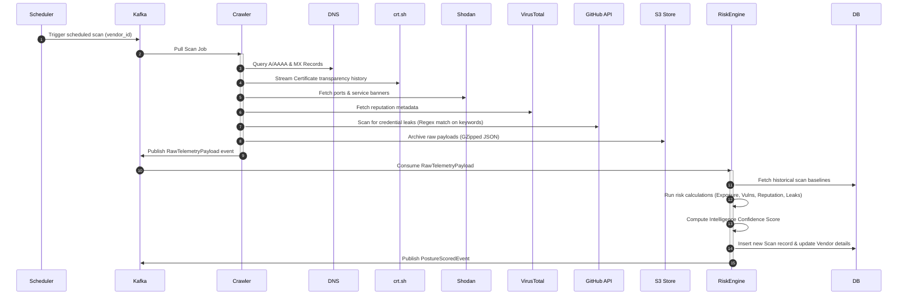
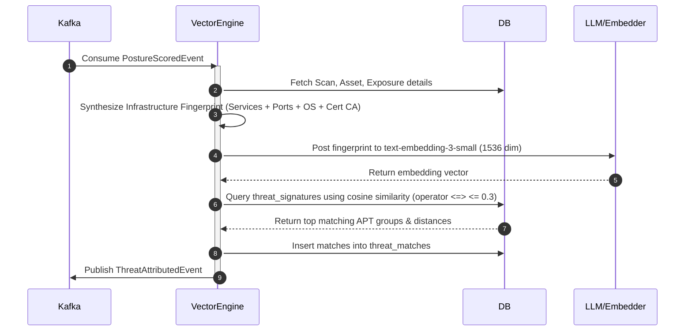
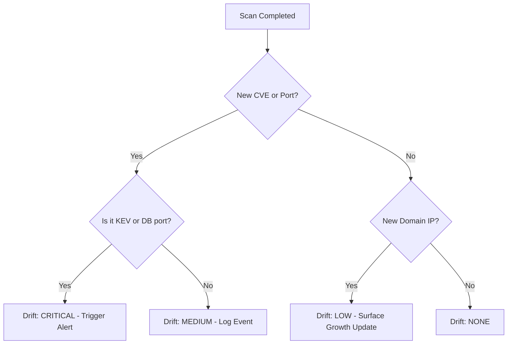
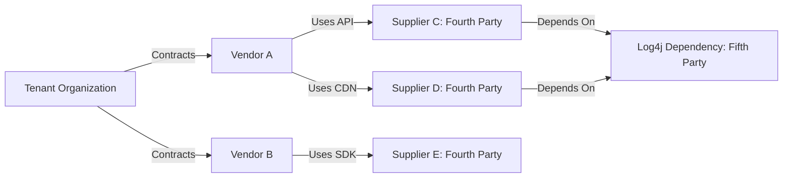
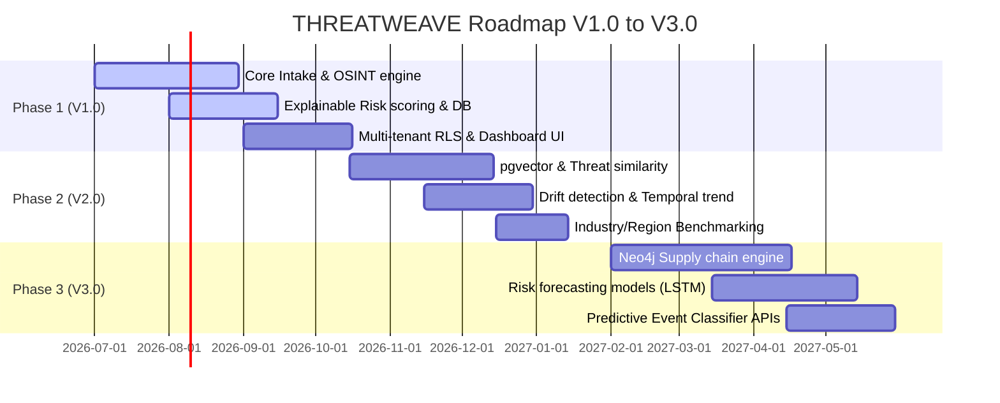

# THREATWEAVE — V1.0 to V3.0 Enterprise Architecture & Implementation Blueprint

---

## 1. REFINED ENTERPRISE PRODUCT ARCHITECTURE

THREATWEAVE is architected as an **AI-powered External Attack Surface Management (EASM), Vendor Risk Intelligence, and Cyber Threat Analytics Platform**. The architecture is engineered around the core principles of high throughput ingestion, distributed queue-driven analysis, explainable AI analytics, zero-trust security, and horizontal scalability.

### Architectural Core Principles

- **Decoupled Data Ingestion & Crawling:** Isolation of target collection processes from analysis engines using message queues.
- **Deterministic & Explainable Scoring:** Separation of telemetry collection and scoring to ensure auditability and transparency.
- **Graph-Based Relations:** Model Nth-party supply chain trust propagation as directed graphs.
- **Vector-Driven Threat Similarity:** Leverages high-dimensional embeddings for actor fingerprinting and attribution.
- **Zero-Trust Multi-Tenancy:** Hard isolation of customer data at the database layer using Row Level Security (RLS) and schema isolation.

---

## 2. SYSTEM ARCHITECTURE DIAGRAM

The system architecture utilizes an event-driven microservices pattern with API Gateways, Distributed Message Brokers, Caching layers, and hybrid database models (Relational + Vector + Graph).



---

## 3. MICROSERVICE DESIGN

The backend is composed of modular, containerized microservices communicating asynchronously via Apache Kafka and synchronously via gRPC.

### Ingestion & Crawler Worker Pool (`ingestion-worker-service`)

- **Purpose:** High-throughput, distributed harvesting of OSINT, threat intelligence, and exposure data.
- **Implementation:** Stateless Go-based runners reading crawling jobs from the Kafka `scan-jobs` topic. Includes proxy rotation, backoff-retry, and rate-limit compliance.
- **Connectors:** Passive DNS (Google DNS over HTTPS), SSL Transparency Logs (crt.sh parsing stream), Infrastructure Exposure (Shodan/Censys wrapper), Domain Reputation (VirusTotal), and Secret exposure discovery (GitHub REST API with active token rotation).

### Core Analytics & Risk Engine (`risk-analytics-service`)

- **Purpose:** Transforms raw OSINT telemetry into structured metrics, classifications, risk scores, and evidence maps.
- **Implementation:** Python-based engine leveraging NumPy, Pandas, and Pydantic for high-performance math processing. Evaluates CVSS metrics, EPSS data, KEV status, and reputation datasets.

### Threat Similarity & Embedding Engine (`vector-attribution-service`)

- **Purpose:** Computes vendor security fingerprints, matches them to APT groups/known campaigns using high-dimensional cosine similarity.
- **Implementation:** FastStream + Python + pgvector. Uses OpenAI's `text-embedding-3-small` or a local fine-tuned SentenceTransformers model (`cyber-securitybert`).

### Forecasting & Predictive Engine (`predictive-ml-service`)

- **Purpose:** Generates attack surface growth forecasts, risk score trends, and likelihood of credential leaks or high-severity vulnerabilities.
- **Implementation:** Python-based workers running statistical time-series (ARIMA/Prophet) and classification models (LightGBM/XGBoost).

### Supply Chain Graph Service (`graph-relationship-service`)

- **Purpose:** Builds dependency mapping, detects upstream/downstream concentration risk, and computes trust propagation scores.
- **Implementation:** Node.js/TypeScript service querying Neo4j. Maintains active directed acyclic graphs (DAGs) representing vendor dependency paths.

---

## 4. DATABASE SCHEMA (PRODUCTION-GRADE POSTGRESQL + PGVECTOR)

```sql
-- Setup Vector and Cryptographic Extensions
CREATE EXTENSION IF NOT EXISTS vector;
CREATE EXTENSION IF NOT EXISTS pgcrypto;

-- Enumerations
CREATE TYPE app_role AS ENUM ('super_admin', 'org_admin', 'analyst', 'read_only');
CREATE TYPE severity_level AS ENUM ('low', 'medium', 'high', 'critical');
CREATE TYPE scan_frequency AS ENUM ('none', 'daily', 'weekly', 'monthly');
CREATE TYPE provider_status AS ENUM ('success', 'timeout', 'error', 'skipped');

-- 1. Organizations (Multi-tenant Root)
CREATE TABLE public.organizations (
    id uuid PRIMARY KEY DEFAULT gen_random_uuid(),
    name text NOT NULL,
    industry_code text NOT NULL, -- NAICS / NACE Code
    region text NOT NULL,        -- Continent/Country Code
    created_at timestamptz NOT NULL DEFAULT now(),
    updated_at timestamptz NOT NULL DEFAULT now()
);

-- 2. Users Table (Linked to Auth System)
CREATE TABLE public.users (
    id uuid PRIMARY KEY DEFAULT gen_random_uuid(),
    organization_id uuid NOT NULL REFERENCES public.organizations(id) ON DELETE CASCADE,
    email text NOT NULL UNIQUE,
    full_name text,
    created_at timestamptz NOT NULL DEFAULT now(),
    updated_at timestamptz NOT NULL DEFAULT now()
);

-- 3. User Roles (RBAC mapping)
CREATE TABLE public.user_roles (
    id uuid PRIMARY KEY DEFAULT gen_random_uuid(),
    user_id uuid NOT NULL REFERENCES public.users(id) ON DELETE CASCADE,
    role app_role NOT NULL,
    created_at timestamptz NOT NULL DEFAULT now(),
    UNIQUE (user_id, role)
);

-- 4. Vendors (Asset Owners Monitored by Organizations)
CREATE TABLE public.vendors (
    id uuid PRIMARY KEY DEFAULT gen_random_uuid(),
    organization_id uuid NOT NULL REFERENCES public.organizations(id) ON DELETE CASCADE,
    name text NOT NULL,
    domain text NOT NULL,
    industry text,
    region text,
    scan_interval scan_frequency NOT NULL DEFAULT 'none',
    risk_score integer NOT NULL DEFAULT 0 CHECK (risk_score BETWEEN 0 AND 100),
    confidence_score integer NOT NULL DEFAULT 0 CHECK (confidence_score BETWEEN 0 AND 100),
    last_successful_scan timestamptz,
    next_scheduled_scan timestamptz,
    created_at timestamptz NOT NULL DEFAULT now(),
    updated_at timestamptz NOT NULL DEFAULT now(),
    CONSTRAINT unique_org_vendor_domain UNIQUE (organization_id, domain)
);

-- 5. Vendor Dependencies (Supply Chain mapping)
CREATE TABLE public.vendor_dependencies (
    id uuid PRIMARY KEY DEFAULT gen_random_uuid(),
    parent_vendor_id uuid NOT NULL REFERENCES public.vendors(id) ON DELETE CASCADE,
    child_vendor_id uuid NOT NULL REFERENCES public.vendors(id) ON DELETE CASCADE,
    depth integer NOT NULL CHECK (depth >= 1), -- 1st party, 2nd party (fourth party overall) etc.
    dependency_weight numeric(3,2) NOT NULL DEFAULT 1.00 CHECK (dependency_weight BETWEEN 0.00 AND 1.00),
    created_at timestamptz NOT NULL DEFAULT now(),
    CONSTRAINT unique_dependency_link UNIQUE (parent_vendor_id, child_vendor_id)
);

-- 6. Scans (Partitioned by scan_date)
CREATE TABLE public.scans (
    id uuid NOT NULL DEFAULT gen_random_uuid(),
    vendor_id uuid NOT NULL REFERENCES public.vendors(id) ON DELETE CASCADE,
    scan_date timestamptz NOT NULL DEFAULT now(),
    risk_score integer CHECK (risk_score BETWEEN 0 AND 100),
    confidence_score integer CHECK (confidence_score BETWEEN 0 AND 100),
    severity severity_level NOT NULL,
    provider_health jsonb NOT NULL, -- crt_sh, shodan, virustotal, github health states
    risk_breakdown jsonb NOT NULL,  -- exposure, vulnerability, reputation, leak components
    scan_metadata jsonb NOT NULL,   -- execution time, crawler nodes, software version
    errors jsonb,                   -- crawl errors
    created_at timestamptz NOT NULL DEFAULT now(),
    PRIMARY KEY (id, scan_date)
) PARTITION BY RANGE (scan_date);

-- Note: In production, table partitioning requires dynamic script creation:
CREATE TABLE scans_2026_h1 PARTITION OF scans FOR VALUES FROM ('2026-01-01 00:00:00+00') TO ('2026-07-01 00:00:00+00');
CREATE TABLE scans_2026_h2 PARTITION OF scans FOR VALUES FROM ('2026-07-01 00:00:00+00') TO ('2027-01-01 00:00:00+00');

-- 7. Discoveries / Exposed Assets
CREATE TABLE public.assets (
    id uuid PRIMARY KEY DEFAULT gen_random_uuid(),
    vendor_id uuid NOT NULL REFERENCES public.vendors(id) ON DELETE CASCADE,
    ip_address inet NOT NULL,
    hostname text,
    hosting_provider text,
    country_code text,
    created_at timestamptz NOT NULL DEFAULT now(),
    updated_at timestamptz NOT NULL DEFAULT now()
);

-- 8. Exposed Ports & Services
CREATE TABLE public.exposures (
    id uuid PRIMARY KEY DEFAULT gen_random_uuid(),
    asset_id uuid NOT NULL REFERENCES public.assets(id) ON DELETE CASCADE,
    port integer NOT NULL CHECK (port BETWEEN 1 AND 65535),
    service_name text,
    cpe text,
    banner text,
    last_seen timestamptz NOT NULL DEFAULT now()
);

-- 9. Vulnerabilities (CVE/CPE references)
CREATE TABLE public.vulnerabilities (
    id uuid PRIMARY KEY DEFAULT gen_random_uuid(),
    asset_id uuid NOT NULL REFERENCES public.assets(id) ON DELETE CASCADE,
    cve_id text NOT NULL,
    cvss_score numeric(3,1) CHECK (cvss_score BETWEEN 0.0 AND 10.0),
    epss_score numeric(4,3),
    known_exploited boolean DEFAULT false,
    remediation_status text NOT NULL DEFAULT 'open',
    detected_at timestamptz NOT NULL DEFAULT now(),
    resolved_at timestamptz
);

-- 10. Leak Discovery (GitHub credentials / API leaks)
CREATE TABLE public.credential_leaks (
    id uuid PRIMARY KEY DEFAULT gen_random_uuid(),
    vendor_id uuid NOT NULL REFERENCES public.vendors(id) ON DELETE CASCADE,
    source_repository text NOT NULL,
    file_path text NOT NULL,
    leak_url text NOT NULL,
    matched_pattern text NOT NULL,
    leak_date timestamptz NOT NULL DEFAULT now()
);

-- 11. Threat Signatures (pgvector Embeddings)
CREATE TABLE public.threat_signatures (
    id uuid PRIMARY KEY DEFAULT gen_random_uuid(),
    apt_group_name text NOT NULL,
    description text NOT NULL,
    vulnerability_fingerprints text[] NOT NULL DEFAULT '{}',
    infrastructure_fingerprint text NOT NULL,
    embedding vector(1536), -- Vector representing structural characteristics
    created_at timestamptz NOT NULL DEFAULT now(),
    updated_at timestamptz NOT NULL DEFAULT now()
);

-- 12. Threat Matches Correlation Table
CREATE TABLE public.threat_matches (
    id uuid PRIMARY KEY DEFAULT gen_random_uuid(),
    scan_id uuid NOT NULL,
    scan_date timestamptz NOT NULL,
    threat_signature_id uuid NOT NULL REFERENCES public.threat_signatures(id) ON DELETE CASCADE,
    similarity_score numeric(4,3) NOT NULL CHECK (similarity_score BETWEEN -1.000 AND 1.000),
    analyst_notes text,
    created_at timestamptz NOT NULL DEFAULT now(),
    FOREIGN KEY (scan_id, scan_date) REFERENCES public.scans(id, scan_date) ON DELETE CASCADE
);

-- 13. Security Benchmarking Records
CREATE TABLE public.benchmarks (
    id uuid PRIMARY KEY DEFAULT gen_random_uuid(),
    vendor_id uuid NOT NULL REFERENCES public.vendors(id) ON DELETE CASCADE,
    industry_average_score numeric(5,2) NOT NULL,
    regional_average_score numeric(5,2) NOT NULL,
    percentile_rank numeric(5,2) NOT NULL,
    calculated_at timestamptz NOT NULL DEFAULT now()
);

-- 14. ML Predictions Table
CREATE TABLE public.risk_predictions (
    id uuid PRIMARY KEY DEFAULT gen_random_uuid(),
    vendor_id uuid NOT NULL REFERENCES public.vendors(id) ON DELETE CASCADE,
    days_ahead integer NOT NULL CHECK (days_ahead IN (30, 90, 180)),
    predicted_risk_score numeric(5,2) NOT NULL,
    confidence_interval_low numeric(5,2) NOT NULL,
    confidence_interval_high numeric(5,2) NOT NULL,
    exposure_probability numeric(3,2) NOT NULL,
    leak_probability numeric(3,2) NOT NULL,
    vuln_growth_probability numeric(3,2) NOT NULL,
    calculated_at timestamptz NOT NULL DEFAULT now()
);

-- 15. Audit Logs Table
CREATE TABLE public.audit_logs (
    id uuid PRIMARY KEY DEFAULT gen_random_uuid(),
    user_id uuid, -- NULL if system action
    action text NOT NULL,
    ip_address inet,
    details jsonb,
    created_at timestamptz NOT NULL DEFAULT now()
);

-- ============== INDEXES & SCALING STRUCTURES ==============

-- Performance Indexes
CREATE INDEX idx_vendors_org_id ON public.vendors(organization_id);
CREATE INDEX idx_scans_vendor_id ON public.scans(vendor_id);
CREATE INDEX idx_assets_vendor_id ON public.assets(vendor_id);
CREATE INDEX idx_exposures_asset_port ON public.exposures(asset_id, port);
CREATE INDEX idx_vulnerabilities_cve ON public.vulnerabilities(cve_id);
CREATE INDEX idx_credential_leaks_vendor ON public.credential_leaks(vendor_id);

-- IVFFlat / HNSW Index for pgvector
-- Use HNSW index for high speed queries with distance function (cosine)
CREATE INDEX idx_threat_signatures_vector ON public.threat_signatures USING hnsw (embedding vector_cosine_ops);

-- ============== ROW LEVEL SECURITY (RLS) POLICIES ==============

ALTER TABLE public.organizations ENABLE ROW LEVEL SECURITY;
ALTER TABLE public.users ENABLE ROW LEVEL SECURITY;
ALTER TABLE public.user_roles ENABLE ROW LEVEL SECURITY;
ALTER TABLE public.vendors ENABLE ROW LEVEL SECURITY;
ALTER TABLE public.scans ENABLE ROW LEVEL SECURITY;
ALTER TABLE public.assets ENABLE ROW LEVEL SECURITY;
ALTER TABLE public.exposures ENABLE ROW LEVEL SECURITY;
ALTER TABLE public.vulnerabilities ENABLE ROW LEVEL SECURITY;
ALTER TABLE public.credential_leaks ENABLE ROW LEVEL SECURITY;
ALTER TABLE public.benchmarks ENABLE ROW LEVEL SECURITY;
ALTER TABLE public.risk_predictions ENABLE ROW LEVEL SECURITY;
ALTER TABLE public.vendor_dependencies ENABLE ROW LEVEL SECURITY;

-- Helper security functions
CREATE OR REPLACE FUNCTION get_user_org()
RETURNS uuid LANGUAGE sql STABLE SECURITY DEFINER SET search_path = public AS $$
    SELECT organization_id FROM public.users WHERE id = auth.uid();
$$;

-- RLS Enforcement Rules
CREATE POLICY org_isolation ON public.organizations
    FOR ALL USING (id = get_user_org());

CREATE POLICY user_isolation ON public.users
    FOR ALL USING (organization_id = get_user_org());

CREATE POLICY vendor_isolation ON public.vendors
    FOR ALL USING (organization_id = get_user_org())
    WITH CHECK (organization_id = get_user_org());

CREATE POLICY scan_isolation ON public.scans
    FOR ALL USING (vendor_id IN (SELECT id FROM public.vendors WHERE organization_id = get_user_org()));

CREATE POLICY asset_isolation ON public.assets
    FOR ALL USING (vendor_id IN (SELECT id FROM public.vendors WHERE organization_id = get_user_org()));

CREATE POLICY exposure_isolation ON public.exposures
    FOR ALL USING (asset_id IN (SELECT id FROM public.assets WHERE vendor_id IN (SELECT id FROM public.vendors WHERE organization_id = get_user_org())));

CREATE POLICY vulnerability_isolation ON public.vulnerabilities
    FOR ALL USING (asset_id IN (SELECT id FROM public.assets WHERE vendor_id IN (SELECT id FROM public.vendors WHERE organization_id = get_user_org())));

CREATE POLICY leak_isolation ON public.credential_leaks
    FOR ALL USING (vendor_id IN (SELECT id FROM public.vendors WHERE organization_id = get_user_org()));

CREATE POLICY benchmark_isolation ON public.benchmarks
    FOR ALL USING (vendor_id IN (SELECT id FROM public.vendors WHERE organization_id = get_user_org()));

CREATE POLICY prediction_isolation ON public.risk_predictions
    FOR ALL USING (vendor_id IN (SELECT id FROM public.vendors WHERE organization_id = get_user_org()));

CREATE POLICY dependency_isolation ON public.vendor_dependencies
    FOR ALL USING (
        parent_vendor_id IN (SELECT id FROM public.vendors WHERE organization_id = get_user_org())
        OR child_vendor_id IN (SELECT id FROM public.vendors WHERE organization_id = get_user_org())
    );
```

---

## 5. DATA FLOW DIAGRAMS

### A. OSINT Ingestion & Scoring Cycle



### B. Vector Embeddings & Threat Similarity Matching



---

## 6. RISK SCORING FRAMEWORK

The platform scores risk dynamically on a scale of **$0$ to $100$** (where $100$ represents maximum security risk). Scoring calculations are transparent, linear, and explainable.

$$\text{Overall Risk Score } (R) = w_{exp} E + w_{vuln} V + w_{rep} R_p + w_{cred} C$$

Where weights are defined as:

- $\text{Exposure Weight } (w_{exp}) = 0.25$
- $\text{Vulnerability Weight } (w_{vuln}) = 0.35$
- $\text{Reputation Weight } (w_{rep}) = 0.20$
- $\text{Credential Leak Weight } (w_{cred}) = 0.20$

---

### A. Exposure Risk Score ($E$)

Evaluates attack surface area based on asset footprint, port open exposures, and certificate configurations:

$$E = \min\left(100, \sum (N_{ports} \times S_{port}) + N_{certs\_expired} \times 15 + S_{cert\_strength}\right)$$

- **Port Severity Weight ($S_{port}$):**
  - _Standard Ports (80, 443, 22):_ $1$ point
  - _Database Ports (3306, 5432, 27017, 6379) exposed:_ $15$ points
  - _Unencrypted Protocols (21 FTP, 23 Telnet) exposed:_ $20$ points
  - _Remote Administration (3389 RDP, 5900 VNC) exposed:_ $25$ points
- **Certificate Strength ($S_{cert\_strength}$):**
  - _Self-Signed Certs:_ $20$ points
  - _Expired Certs:_ $15$ points
  - _Mismatched Domain Cert:_ $10$ points

---

### B. Vulnerability Risk Score ($V$)

Transforms active CVE exposures into an index using CVSS, EPSS (Exploit Prediction Scoring System), and KEV (Known Exploited Vulnerability) lists. For each detected vulnerability $v \in \mathcal{V}$:

$$V_v = \text{CVSS}_v \times (1.0 + 0.3 \times \mathbb{I}_{\text{EPSS\_high}} + 0.5 \times \mathbb{I}_{\text{KEV\_active}})$$

- $\mathbb{I}_{\text{EPSS\_high}} = 1$ if the EPSS score $> 0.25$, otherwise $0$.
- $\mathbb{I}_{\text{KEV\_active}} = 1$ if the CVE is on the CISA KEV list, otherwise $0$.
- The raw Vulnerability score is aggregated as:

$$V = \min\left(100, \sum_{v \in \mathcal{V}} V_v\right)$$

---

### C. Reputation Risk Score ($R_p$)

Calculated from VirusTotal engines flagging the host domain, blacklist entries, and community consensus:

$$R_p = \min\left(100, \frac{\text{VT\_Malicious\_Detections}}{\text{VT\_Total\_Engines}} \times 100 \times 2.0 + N_{blacklists} \times 20\right)$$

---

### D. Credential Exposure Risk Score ($C$)

Derived from the count and sensitivity of exposed repository keys/secrets discovered:

$$C = \min\left(100, \sum (N_{leak\_critical} \times 35) + (N_{leak\_high} \times 15)\right)$$

- **Critical Leaks ($N_{leak\_critical}$):** Cloud provider keys (AWS, GCP, Azure), database connection strings.
- **High Leaks ($N_{leak\_high}$):** SaaS API keys, deployment SSH keys, internal domain passwords.

---

### E. Intelligence Confidence Score ($CS$)

Confidence defines data freshness, vendor completeness, and active provider health metrics during the crawling lifecycle.

$$CS = \text{Freshness} \times 0.40 + \text{Completeness} \times 0.40 + \text{ProviderHealth} \times 0.20$$

1.  **Freshness Score:**
    $$\text{Freshness} = \max\left(0, 100 - \frac{\text{Hours since last successful scan}}{2.4}\right)$$
2.  **Completeness Score:** Percentage of successful OSINT integrations completed (e.g., if 4 out of 5 integrations succeeded, completeness = 80%).
3.  **Provider Health Score:**
    $$\text{ProviderHealth} = \frac{\sum \text{Provider\_Weight\_Successful}}{\sum \text{Total\_Required\_Providers}} \times 100$$

---

### F. Severity Classification Table

The final Risk Score mapping is aligned with enterprise standards:

| Risk Score Range | Severity | Action SLA | Description                                                         |
| :--------------- | :------- | :--------- | :------------------------------------------------------------------ |
| **85 - 100**     | Critical | 24 Hours   | Immediate exploit path exists (CISA KEV or clear credential leak).  |
| **70 - 84**      | High     | 72 Hours   | Exposed databases, RDP ports, or high CVSSv3 vulnerabilities.       |
| **40 - 69**      | Medium   | 14 Days    | Standard CVEs with low EPSS, certificate expire warnings, open SSH. |
| **0 - 39**       | Low      | 60 Days    | Minor exposure, informational open ports, clean reputation.         |

---

## 7. THREAT SIMILARITY FRAMEWORK (V2.0)

Attribution determines if a vendor's exposure fingerprint aligns with the characteristics of a specific threat actor (APT) or active campaign.

### Feature Structuring & Vector Conversion

For each scanned asset, the service constructs a raw textual fingerprint:

```text
PortPattern: [22, 80, 443, 3389]
ServiceBanners: [SSH-2.0-OpenSSH_8.2p1, nginx/1.18.0, Microsoft-HTTPAPI/2.0]
CPEs: [cpe:2.3:a:nginx:nginx:1.18.0, cpe:2.3:o:microsoft:windows]
CertCA: [Let's Encrypt]
VulnCVEs: [CVE-2021-44228, CVE-2023-3519]
VTReputation: [Clean]
```

This raw representation is passed to the embedding engine, which generates a normalized 1536-dimensional vector:

$$\mathbf{v}_{\text{vendor}} \in \mathbb{R}^{1536}, \quad \|\mathbf{v}_{\text{vendor}}\| = 1$$

### Cosine Similarity Search

Attribution uses pgvector's cosine distance operator (`<=>`). Cosine similarity is computed as:

$$\text{Similarity}(\mathbf{v}_{\text{vendor}}, \mathbf{v}_{\text{threat\_sig}}) = 1 - \text{CosineDistance} = \frac{\mathbf{v}_{\text{vendor}} \cdot \mathbf{v}_{\text{threat\_sig}}}{\|\mathbf{v}_{\text{vendor}}\| \|\mathbf{v}_{\text{threat\_sig}}\|}$$

Database retrieval query matching signatures with high similarity ($>0.75$):

```sql
SELECT
    id,
    apt_group_name,
    description,
    1 - (embedding <=> :vendor_vector) AS similarity_score
FROM
    public.threat_signatures
WHERE
    1 - (embedding <=> :vendor_vector) >= 0.75
ORDER BY
    similarity_score DESC
LIMIT 5;
```

---

## 8. HISTORICAL ANALYTICS & DRIFT DETECTION FRAMEWORK (V2.0)

Historical analytics continuously evaluate drift in the attack surface, computing delta variances across regular scans.

### State Tracking Model

Given a scan sequence $S_1, S_2, \dots, S_t$ for vendor $V$:

- **Attack Surface Growth Metric ($ASG_t$):**
  $$ASG_t = \frac{|A_t| - |A_{t-1}|}{|A_{t-1}|} \times 100$$
  Where $|A_t|$ is the number of active exposed ports + IP endpoints in scan $t$.
- **Risk Delta Metric ($\Delta R_t$):**
  $$\Delta R_t = R_t - R_{t-1}$$
- **30-Day Risk Baseline Reference:**
  $$R_{\text{base}} = \frac{1}{N} \sum_{i \in \text{last 30 days}} R_i$$

### Attack Surface Drift Severity Classification

Drift severity triggers security alerts based on the velocity of growth and the danger of newly discovered features:



---

## 9. BENCHMARKING FRAMEWORK (V2.0)

This engine calculates a vendor's risk percentile and tracks their standing relative to industry, geographic region, and organization portfolios.

### Percentile Ranking Calculation

Given a vendor's risk score $R_v$, and the distribution of scores in their designated peer group $\mathcal{G}$ of size $N$:

$$P_v = \left( 1 - \frac{|\{ x \in \mathcal{G} \mid x < R_v \}| + 0.5 \times |\{ x \in \mathcal{G} \mid x = R_v \}|}{N} \right) \times 100$$

_(Note: Since higher risk scores represent worse posture, a lower $P_v$ indicates a healthier vendor standing)._

- **Multi-Dimensional Peer Groups:**
  - **NAICS Peer Group:** Compare with vendors matching the first 4 digits of the NAICS code.
  - **Geographical Peer Group:** Compare within regional locations (e.g. EU West, NA East).
  - **Portfolio Peer Group:** Compare within the organization's own managed supply chain list.

---

## 10. SUPPLY CHAIN INTELLIGENCE FRAMEWORK (V3.0)

A tenant's business vendor relies on suppliers, who in turn rely on fourth-party and fifth-party libraries, hosting nodes, and software tools. The Supply Chain Engine maps this cascading network.



### Dependency Risk Propagation Model

Risk values propagate upstream through critical trust pathways:

$$R_{\text{vendor}} = \max\left(R_{\text{direct}}, \sum_{i \in \text{Suppliers}} w_i \times R_{\text{supplier\_i}} \times d^{-\lambda}\right)$$

Where:

- $w_i$ is the dependency weight factor (reflecting dependency criticality, e.g. Core API = $1.0$, Analytics script = $0.1$).
- $d$ is the relationship depth ($d \ge 1$ where $d=1$ is a third-party vendor, $d=2$ is fourth-party).
- $\lambda$ is the decay constant, typically set to $0.5$.

### Concentration Risk Detection

Concentration risk alerts organizations when multiple third-party vendors depend on a single fourth/fifth-party infrastructure platform (e.g. 80% of vendors depending on AWS us-east-1, or Cloudflare DNS, or an outdated OpenSSL sub-package).

---

## 11. FORECASTING & RISK PREDICTION FRAMEWORK (V3.0)

### Time Series Risk Projection

The forecasting service uses double exponential smoothing (Holt-Winters) and LSTM networks to project future vendor risk scores over 30, 90, and 180 days:

$$\hat{R}_{t+k \mid t} = \ell_t + k b_t$$

Where level $\ell_t$ and trend $b_t$ incorporate historical score variances. Confidence bounds are calculated using the standard error of prediction:

$$\text{Bounds} = \hat{R}_{t+k} \pm Z_{\alpha/2} \times \sigma_k$$

### Probabilistic Event Classifiers

Supervised binary classifiers (XGBoost) calculate the likelihood of specific security incidents within the next 90 days:

$$P(\text{Incident} = 1 \mid \mathbf{X}) = \frac{1}{1 + e^{-\boldsymbol{\beta}^T \mathbf{X}}}$$

Where the vector $\mathbf{X}$ represents features including:

- Attack surface growth velocity ($ASG$)
- Unresolved high-severity CVE counts
- Average intelligence confidence score
- Historical credential leak events
- Threat similarity matches with active target groups

---

## 12. SECURITY ARCHITECTURE

### Tenant Isolation

The platform implements tenant isolation inside Supabase/PostgreSQL. RLS policies intercept all queries and inject `WHERE organization_id = current_setting('app.current_org_id')`.

- Direct access policies use cryptographic UUID validations.
- Write actions require validations ensuring target elements belong to the tenant's own domain registration list.

### Encryption System

- **Data at Rest:** Transparent Data Encryption (TDE) via AWS KMS managed keys.
- **Sensitive Fields (API Keys/Secrets):** Encrypted using PGcrypto at the cell-level using AES-256-GCM.
- **Data in Transit:** TLS 1.3 for internal microservice communications and external dashboard clients.

---

## 13. API ARCHITECTURE (OPENAPI 3.0 SPECIFICATION)

```yaml
openapi: 3.0.3
info:
  title: THREATWEAVE API
  version: 3.0.0
paths:
  /api/v1/vendors:
    get:
      summary: Retrieve all monitored vendors with risk scoring
      security:
        - BearerAuth: []
      parameters:
        - name: limit
          in: query
          schema:
            type: integer
            default: 10
        - name: offset
          in: query
          schema:
            type: integer
            default: 0
      responses:
        "200":
          description: A list of vendors
          content:
            application/json:
              schema:
                type: array
                items:
                  $ref: "#/components/schemas/Vendor"
  /api/v1/scans/{vendorId}:
    post:
      summary: Trigger an on-demand OSINT scan for a specific vendor
      parameters:
        - name: vendorId
          in: path
          required: true
          schema:
            type: string
            format: uuid
      responses:
        "202":
          description: Scan job accepted and queued in Kafka
          content:
            application/json:
              schema:
                $ref: "#/components/schemas/ScanJobReceipt"
components:
  securitySchemes:
    BearerAuth:
      type: http
      scheme: bearer
      bearerFormat: JWT
  schemas:
    Vendor:
      type: object
      properties:
        id:
          type: string
          format: uuid
        name:
          type: string
        domain:
          type: string
        risk_score:
          type: integer
        confidence_score:
          type: integer
        last_successful_scan:
          type: string
          format: date-time
    ScanJobReceipt:
      type: object
      properties:
        job_id:
          type: string
          format: uuid
        status:
          type: string
        estimated_wait_seconds:
          type: integer
```

---

## 14. DASHBOARD SPECIFICATIONS

```text
+----------------------------------------------------------------------------+
|  THREATWEAVE Enterprise Dashboard               Tenant: ACME Corp         |
+----------------------------------------------------------------------------+
|  VENDORS  |  RISK SCORE  |  CRITICAL FINDINGS  |  ACTIVE SCANS  | ALERTS   |
|   142     |  54 (Med)    |        12           |       3        |   [!]    |
+----------------------------------------------------------------------------+
|  PORTFOLIO RISK TREND (30 Days)                                            |
|  Score 80 |                                           * (Forecast high)    |
|  Score 60 |                 *---*---*---*            /                     |
|  Score 40 |    *---*---*---*             *---*---*--o                      |
|           +-----------------------------------------*----------------------+
|               Day 1   Day 5   Day 10  Day 20  Day 30  +10d   +30d          |
+----------------------------------------------------------------------------+
|  HIGH RISK VENDORS                       |  RECENT DRIFT ALERTS            |
|  1. supplier-a.com   [Risk: 88] [!]      |  - new-db-port.com (Port 5432)  |
|  2. dev-vendor.net   [Risk: 82] [!]      |  - leaked-repo.org (Github API) |
|  3. billing-api.co   [Risk: 74]          |  - expired-ssl.net (Cert Exp.)  |
+----------------------------------------------------------------------------+
```

---

## 15. DEVELOPMENT ROADMAP



---

## 16. SCALING & DEPLOYMENT STRATEGY

### Database Clustering & Cache Layer

- **Connection Pooling:** Implements `PgBouncer` to manage high concurrent microservice database queries.
- **Read-Replicas:** Offloads reporting, analytical queries, and compliance audit functions to Read-Only DB nodes.
- **Redis Caching:** Standard scans, vendor metadata, and calculated benchmarks are cached in Redis with a 12-hour TTL to save database query cycles.

### Event Ingestion Queue Scaling

Kafka partitions are aligned with vendor domains:

$$\text{Partition Key} = \text{Hash}(\text{vendor\_domain}) \pmod{\text{Partition Count}}$$

This ensures scan event sequence accuracy for any specific vendor asset.

---

## 17. PRODUCTION DEPLOYMENT PLAN

The platform deployment relies on infrastructure as code (IaC) and is deployed on Kubernetes (EKS / GKE).

### Terraform Module Architecture

```text
terraform-threatweave/
├── main.tf                 # EKS, VPC, and Routing infrastructure definitions
├── variables.tf            # Region, instance sizing, database scaling params
├── modules/
│   ├── database/           # RDS Aurora Postgres + pgvector setup
│   ├── queue/              # Managed Kafka MSK cluster
│   ├── caching/            # ElastiCache Redis cluster
│   └── microservices/      # Helm-releases deployment definitions
```

### Kubernetes Helm deployment

```yaml
# values.yaml for Ingestion Worker
replicaCount: 15
image:
  repository: threatweave/ingestion-worker
  tag: v3.0.0
resources:
  limits:
    cpu: 2000m
    memory: 4Gi
  requests:
    cpu: 500m
    memory: 1Gi
autoscaling:
  enabled: true
  minReplicas: 5
  maxReplicas: 50
  targetCPUUtilizationPercentage: 80
```

### Telemetry & Monitoring (Prometheus & Grafana)

- **Ingestion Metrics:** Crawling success rate, API token expiration rates, request latencies.
- **Database Metrics:** pgvector index scan speeds, query CPU utilization, connection pool limits.
- **ML Service Monitoring:** Predictor drift metrics, prediction accuracy metrics, and scoring computation latencies.
